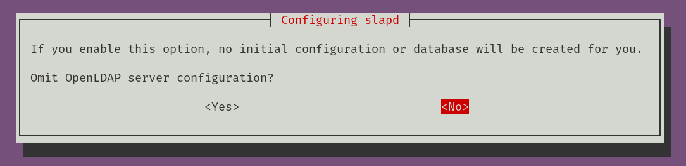

## Creating example LDAP server via OpenLDAP

Here is the guidline to create a LDAP server for testing purpose:

If you're using Public Cloud providers, might be better idea to use Private IP address:

```
#for example:
{
    PRIVATE_IP=10.0.1.6
    LDAP_FQDN=ldap-server.example.local
    echo "$PRIVATE_IP $LDAP_FQDN" >> /etc/hosts
}
```

#### Install OpenLDAP package:

Here in this steps, it will prompt you for configuring LDAP administrator password.

```
{
    apt update
    apt install slapd ldap-utils
}
```

Now and after installation has finished, we need to configure LDAP server:

```
dpkg-reconfigure slapd
```


Make sure to click `No` and proceed.

At the next step we need to configure a DNS name for the LDAP base DN:


In our example it would be `example.local`

And also it's same for the next step as `Organization`

after providing the administrator password, select `No` when it prompted for purging the db:


And finally select `Yes` for moving the old DB:


#### Configuring OpenLDAP config file:

Now it's time to reconfigure LDAP config file to use the new information we just configured:

```
{
    vi /etc/ldap/ldap.conf
}
```
#Uncomment and provide the correct info:

`BASE    dc=example,dc=local`

`URI     ldap://ldap-server.example.local`

```
{
    systemctl restart slapd
    systemctl status slapd
}
```

You can check and verfy the LDAP configuration by this command:

```
{
    ldapsearch -Q -LLL -Y EXTERNAL -H ldapi:///
}
```

#### Activate `memberOf'

First we need to check current module list to check then next index we should create a new entry with the next available index for memberOf module:

```
ldapsearch -Q -LLL -Y EXTERNAL -H ldapi:/// -b cn=config '(objectClass=olcModuleList)' dn

# or 

ls  /etc/ldap/slapd.d/cn\=config/
```

In our example the next available index is 1:
```
cat > load-memberof.ldif
dn: cn=module{1},cn=config
objectClass: olcModuleList
cn: module{1}
olcModulePath: /usr/lib/ldap
olcModuleLoad: memberof.la

ldapadd -Q -Y EXTERNAL -H ldapi:/// -f load-memberof.ldif
adding new entry "cn=module{1},cn=config"
```

#Verify module list:
```
ldapsearch -Q -LLL -Y EXTERNAL -H ldapi:/// -b cn=config '(objectClass=olcModuleList)' dn
dn: cn=module{0},cn=config

dn: cn=module{1},cn=config
```

#To determine which database configuration you need to apply the memberOf overlay to, you can perform an LDAP search to list the database entries in your configuration:

```
ldapsearch -Q -LLL -Y EXTERNAL -H ldapi:/// -b cn=config '(objectClass=olcDatabaseConfig)' dn
dn: olcDatabase={-1}frontend,cn=config

dn: olcDatabase={0}config,cn=config

dn: olcDatabase={1}mdb,cn=config
```

#Configure the memberOf overlay
```
cat > memberof-overlay.ldif 
dn: olcOverlay=memberof,olcDatabase={1}mdb,cn=config
objectClass: olcOverlayConfig
objectClass: olcMemberOf
olcOverlay: memberof
olcMemberOfDangling: ignore
olcMemberOfRefInt: TRUE

ldapadd -Q -Y EXTERNAL -H ldapi:/// -f memberof-overlay.ldif
adding new entry "olcOverlay=memberof,olcDatabase={1}mdb,cn=config"
```

#restart the slapd

```
systemctl restart slapd
```

#Verify memberOf module:

```
ldapsearch -Q -LLL -Y EXTERNAL -H ldapi:/// -b cn=config olcOverlay=memberof
dn: olcOverlay={0}memberof,olcDatabase={1}mdb,cn=config
objectClass: olcOverlayConfig
objectClass: olcMemberOfConfig
olcOverlay: {0}memberof
olcMemberOfDangling: ignore
olcMemberOfRefInt: TRUE
```


#### Creating two main OUs for storing other groups and users:

Run below command to add OUs to the LDAP:

```
ldapadd -x -D cn=admin,dc=example,dc=local -W -f organizationalUnits.ldif
```

#### Creating some random groups for storing users:

Run below command to add groups to the LDAP:

```
ldapadd -x -D cn=admin,dc=example,dc=local -W -f groups.ldif
```

#### Creating some random users:

First we need to generate a password for users, so you can run this command to generate a new one and replace the while encrypted result with password `userPassword` in users.ldif file.

```
slappasswd
```

Next, run below command to add users to the LDAP:

```
ldapadd -x -D cn=admin,dc=example,dc=local -W -f users.ldif
```

#### Verifying all created objects.

Now you can run below commands to verify all the objects we just created:

```
ldapsearch -x -LLL -b "uid=Liam,ou=users,dc=example,dc=local" memberOf
dn: uid=Liam,ou=users,dc=example,dc=local

ldapsearch -x -LLL -b "uid=Olivia,ou=users,dc=example,dc=local" memberOf
dn: uid=Olivia,ou=users,dc=example,dc=local
```

```
ldapsearch -Q -LLL -Y EXTERNAL -H ldapi:///
```
```
ldapsearch -D "cn=admin,dc=example,dc=local" -W -b "OU=users,DC=example,DC=local"
```

```
ldapsearch -x -LLL -b dc=example,dc=local '(uid=Charlotte)' cn uidNumber gidNumber
```